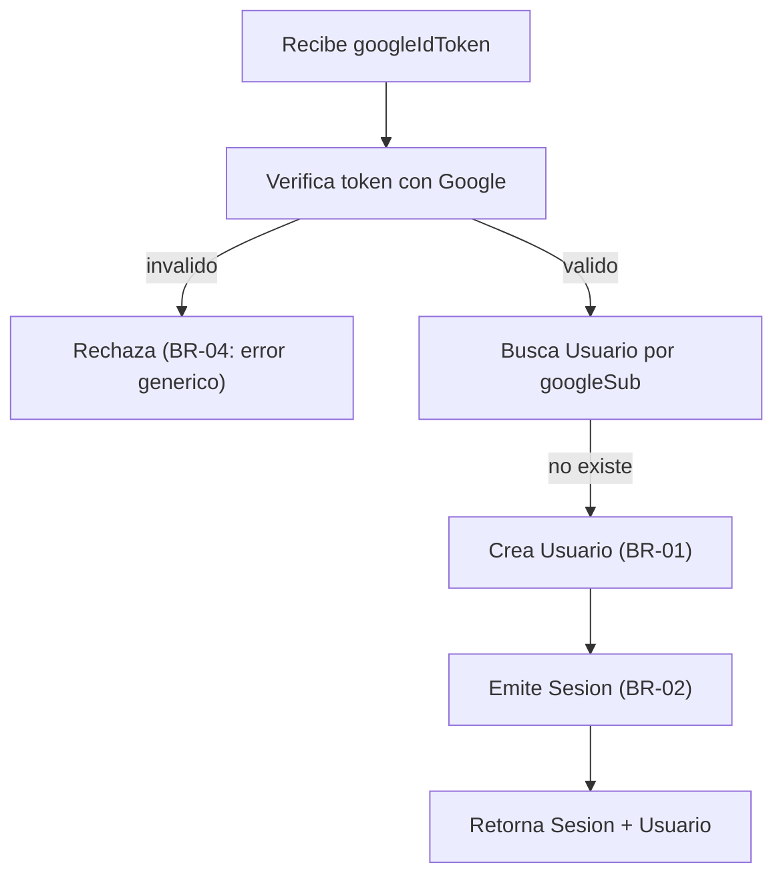
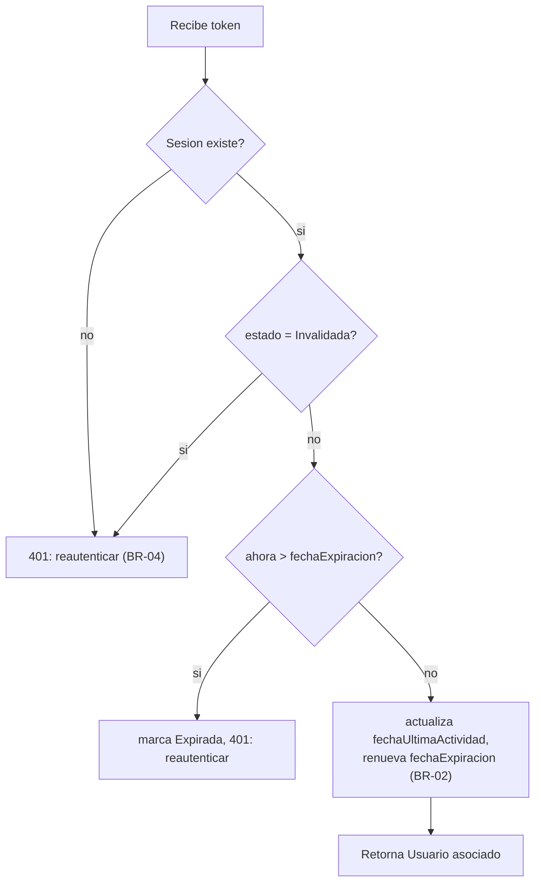

# Modelo de Lógica de Negocio — Unidad 1: Identidad y Autenticación

## Flujo 1: Primer Inicio de Sesión (Usuario Nuevo)



### Alternativa en texto
```
1. Recibe googleIdToken
2. Verifica el token con Google
   - Si es invalido -> rechaza con error generico (BR-04)
3. Busca Usuario por googleSub
   - Si no existe -> crea Usuario nuevo (BR-01: clave = googleSub, no correo)
4. Emite Sesion (BR-02: valida 24h, renovable)
5. Retorna Sesion + datos de Usuario
```

## Flujo 2: Inicio de Sesión Recurrente (Usuario Existente)

Igual al Flujo 1, salvo que en el paso 3 el `Usuario` ya existe: se actualiza `fechaUltimoLogin` en vez de crear un registro nuevo (ver Propiedad Testeable PROP-03, idempotencia).

## Flujo 3: Validación de Sesión en Cada Request



### Alternativa en texto
```
1. Recibe token
2. Si no existe una Sesion con ese token -> 401 (BR-04)
3. Si la Sesion esta Invalidada -> 401 (BR-04, BR-05)
4. Si ahora > fechaExpiracion -> marca Expirada, 401 (BR-04)
5. En cualquier otro caso: actualiza fechaUltimaActividad,
   renueva fechaExpiracion (+24h, BR-02), retorna el Usuario asociado
```

## Flujo 4: Cerrar Sesión

`cerrarSesion(token)` marca la `Sesion` como `Invalidada` con `fechaInvalidacion = ahora`, de forma inmediata e irreversible (BR-05). Operación idempotente: invocarla dos veces sobre el mismo token no cambia el resultado observable después de la primera vez (ver PROP-02).

## Flujo 5: Fallo de Verificación con Google (Revocación / Cuenta Eliminada)

Cuando `validarSesion` o un nuevo intento de login detecta que el token de Google ya no es válido, solo se invalida la `Sesion` en curso (si existía). El `Usuario`, sus grupos y sus datos financieros no se tocan (BR-03) — permanecen disponibles para la próxima vez que el login sea exitoso.

---

## Propiedades Testeables (PBT-01)

Identificadas para guiar las pruebas basadas en propiedades en Code Generation (extensión Property-Based Testing habilitada, enforcement completo).

| ID | Categoría | Propiedad | Relacionada a |
|---|---|---|---|
| PROP-01 | Invariante | Todo `Usuario` persistido tiene un `googleSub` no vacío y único en el sistema — para cualquier secuencia de logins generada aleatoriamente, nunca existen dos `Usuario` con el mismo `googleSub`. | BR-01 |
| PROP-02 | Idempotencia | `cerrarSesion(token)` aplicado dos veces seguidas sobre el mismo token produce el mismo estado observable que aplicarlo una vez (`estado = Invalidada`, sin error en la segunda llamada). | BR-05 |
| PROP-03 | Idempotencia / Invariante | `iniciarSesionConGoogle` llamado repetidamente con tokens de Google válidos para el mismo `googleSub` nunca incrementa el número de registros `Usuario` más allá de 1 — solo actualiza `fechaUltimoLogin`. | BR-01 |
| PROP-04 | Round-trip | Para cualquier `Sesion` recién emitida por `iniciarSesionConGoogle`, llamar inmediatamente a `validarSesion(token)` devuelve el mismo `Usuario` (mismo `id`/`googleSub`) que originó la sesión. | Flujo 1 → Flujo 3 |
| PROP-05 | Invariante temporal (stateful) | Para cualquier secuencia generada de eventos sobre una `Sesion` (crear, N actividades, expirar y/o invalidar en cualquier orden temporal válido), `validarSesion` nunca devuelve un `Usuario` válido una vez que `estado` es `Expirada` o `Invalidada`. | BR-02, BR-05 |
| PROP-06 | Invariante | `fechaExpiracion` de toda `Sesion`, en cualquier momento de su ciclo de vida (creación o cualquier renovación silenciosa), es siempre posterior a `fechaUltimaActividad`. | BR-02 |

**Componentes sin propiedades adicionales identificadas**: la verificación del token de Google en sí (`Flujo 1`/`Flujo 2`, paso "Verifica token con Google") depende de un servicio externo (Google) y se cubre con pruebas de integración/contract testing en Build and Test, no con PBT interno — no se identifica una propiedad de negocio adicional más allá de PROP-01/03/04 ya listadas.
