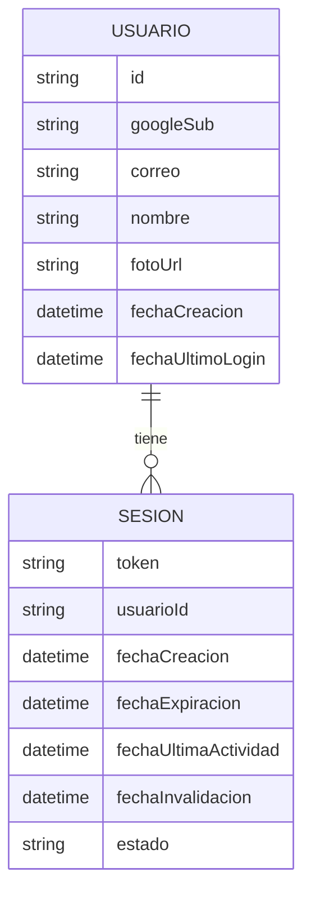

# Entidades de Dominio — Unidad 1: Identidad y Autenticación

## Entidad: Usuario

| Campo | Tipo | Descripción |
|---|---|---|
| `id` | identificador interno | Clave primaria del sistema (no expuesta a otros dominios más que como referencia). |
| `googleSub` | string | Identificador único de cuenta de Google (claim `sub` del token OpenID Connect). **Es la clave real de unicidad**, no el correo (Pregunta 3 = A). |
| `correo` | string | Correo asociado a la cuenta de Google al momento del login. Puede repetirse entre dos `Usuario` distintos en el caso raro de una cuenta de Google eliminada y recreada (ver BR-01). |
| `nombre` | string | Nombre para mostrar. |
| `fotoUrl` | string (opcional) | Foto de perfil de Google. |
| `fechaCreacion` | timestamp | Momento del primer login. |
| `fechaUltimoLogin` | timestamp | Se actualiza en cada login exitoso. |

## Entidad: Sesion

| Campo | Tipo | Descripción |
|---|---|---|
| `token` | string | Identificador de sesión emitido por el sistema (no es el token de Google). |
| `usuarioId` | referencia a `Usuario` | Dueño de la sesión. |
| `fechaCreacion` | timestamp | Momento de emisión. |
| `fechaExpiracion` | timestamp | `fechaCreacion` (o última renovación) + ~24 horas (Pregunta 1 = B). |
| `fechaUltimaActividad` | timestamp | Se actualiza en cada request válido; usada para decidir la renovación silenciosa. |
| `fechaInvalidacion` | timestamp (opcional) | Se completa si el usuario cierra sesión explícitamente. |
| `estado` | enum: `Activa` \| `Expirada` \| `Invalidada` | Estado derivado a partir de las fechas anteriores. |

## Relaciones



### Alternativa en texto
```
Usuario (1) ---- tiene ---- (0..N) Sesion
```

**Fuera del alcance de esta unidad**: la relación de `Usuario` con `GrupoFamiliar`/`Membresia` pertenece al dominio de la Unidad 2 (Grupos Familiares) — esta unidad solo expone el `usuarioId` como referencia externa, no modela membresías.
