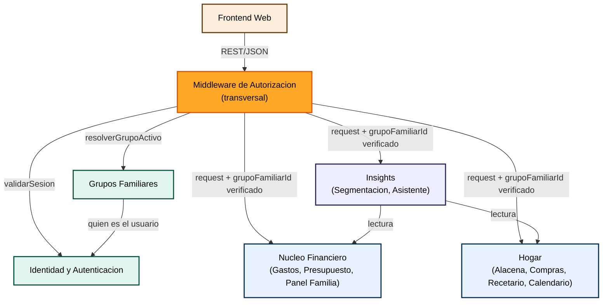

# Dependencias entre Componentes — FamilyFinance

## Matriz de Dependencias

| Componente | Depende de | Tipo de dependencia |
|---|---|---|
| Frontend Web | Todos los componentes backend | Llamadas REST síncronas (Pregunta 3 = A) |
| Middleware de Autorización | Identidad y Autenticación, Grupos Familiares | Llamada directa síncrona (interna al monolito) |
| Grupos Familiares | Identidad y Autenticación | Llamada directa síncrona — necesita saber quién es el usuario autenticado |
| Núcleo Financiero | Grupos Familiares (vía Middleware) | Recibe `grupoFamiliarId` ya resuelto, no llama directamente a Grupos Familiares |
| Hogar | Grupos Familiares (vía Middleware) | Igual que Núcleo Financiero |
| Insights | Núcleo Financiero, Hogar | Llamadas directas síncronas de solo lectura, acotadas al `grupoFamiliarId` del contexto |
| Identidad y Autenticación | Ninguno | Componente base, no depende de otros componentes de negocio |

## Patrones de Comunicación

- **Frontend ↔ Backend**: REST + JSON sobre HTTPS (Pregunta 3 = A). El frontend nunca llama directamente a un componente de negocio sin pasar por el Middleware de Autorización.
- **Entre componentes backend**: llamadas directas síncronas (funciones/métodos en el mismo proceso), consistente con el monolito modular (Pregunta 2 = A) y la orquestación síncrona (Pregunta 4 = A). No hay bus de eventos ni mensajería en este ciclo.
- **Regla transversal (SECURITY-08)**: ningún componente de negocio (Núcleo Financiero, Hogar, Insights) acepta un `grupoFamiliarId` que venga directamente del cliente — siempre lo recibe ya resuelto y verificado por el Middleware de Autorización a partir de la sesión del usuario.

## Diagrama de Dependencias y Flujo de Datos



### Alternativa en texto
```
Frontend Web --(REST/JSON)--> Middleware de Autorizacion
Middleware --(validarSesion)--> Identidad y Autenticacion
Middleware --(resolverGrupoActivo)--> Grupos Familiares
Middleware --(request + grupoFamiliarId verificado)--> Nucleo Financiero
Middleware --(request + grupoFamiliarId verificado)--> Hogar
Middleware --(request + grupoFamiliarId verificado)--> Insights
Grupos Familiares --(quien es el usuario)--> Identidad y Autenticacion
Insights --(lectura)--> Nucleo Financiero
Insights --(lectura)--> Hogar
```

## Notas de Acoplamiento

- **Identidad y Autenticación** es el único componente sin dependencias salientes — es la base de todo el sistema.
- **Grupos Familiares** es el segundo componente más crítico: todos los componentes de negocio dependen (indirectamente, vía Middleware) de que resuelva correctamente el `grupoFamiliarId`. Cualquier bug aquí compromete el aislamiento multi-tenant de todo el sistema — por eso es la primera unidad a construir después de Identidad (ver secuencia en `execution-plan.md`).
- **Insights** es el componente con más dependencias de lectura (Núcleo Financiero + Hogar), consistente con que se construye al final, una vez esos datos ya existen.
- **Frontend Web** depende de todos, pero ningún componente backend depende del frontend — permite que el frontend evolucione (incluyendo el roadmap futuro de PWA/app nativa) sin tocar el backend, siempre que se respete el contrato REST.
