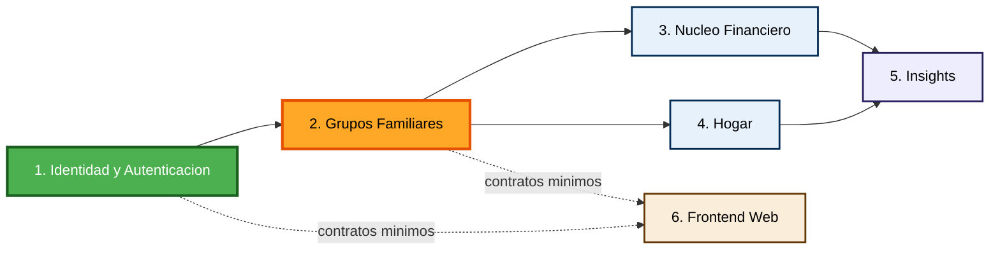

# Dependencias entre Unidades de Trabajo — FamilyFinance

## Matriz de Dependencias

| Unidad | Depende de | Bloquea a |
|---|---|---|
| 1. Identidad y Autenticación | Ninguna | 2, 3, 4, 5, 6 (indirectamente, todo requiere un usuario autenticado) |
| 2. Grupos Familiares | 1 | 3, 4, 5, 6 (todo dato pertenece a un `grupoFamiliarId` resuelto aquí) |
| 3. Núcleo Financiero | 2 | 5 (Insights lee sus datos) |
| 4. Hogar | 2 | 5 (Insights lee sus datos) |
| 5. Insights | 3, 4 | Ninguna |
| 6. Frontend Web | 1, 2 (mínimo para operar); idealmente 3, 4, 5 para el producto completo | Ninguna |

## Secuencia de Construcción Recomendada



### Alternativa en texto
```
1. Identidad y Autenticacion (sin dependencias, se construye primero)
   -> 2. Grupos Familiares (depende de 1; critica, bloquea todo lo demas)
        -> 3. Nucleo Financiero (depende de 2)
        -> 4. Hogar (depende de 2; en paralelo con 3 si hay mas de 1 desarrollador)
             -> 5. Insights (depende de 3 y 4)
6. Frontend Web: puede empezar en paralelo apenas existan los contratos de API de 1 y 2
```

## Notas

- **Con un solo desarrollador** (Pregunta 2 de `unit-of-work-plan.md` = A): la secuencia se recorre estrictamente en el orden 1 → 2 → 3 → 4 → 5, con el Frontend Web (6) avanzando en paralelo apenas los contratos de las Unidades 1 y 2 estén definidos, para no dejarlo completamente al final.
- **Si en el futuro se suma más gente al equipo**: las Unidades 3 (Núcleo Financiero) y 4 (Hogar) pueden construirse en paralelo una vez completada la Unidad 2, ya que no dependen entre sí (confirmado en `component-dependency.md`).
- **Unidad 2 es el punto de mayor riesgo**: cualquier defecto en cómo resuelve el `grupoFamiliarId` compromete el aislamiento multi-tenant de todas las unidades que dependen de ella — debe recibir especial atención en Functional Design y Code Generation (PBT: invariante de aislamiento multi-tenant, ver `requirements.md` NFR-02).
