# Plan de Ejecución — FamilyFinance (SaaS Multi-Tenant)

## Resumen del Análisis Detallado

### Alcance de la Transformación (Brownfield)
- **Tipo de Transformación**: **Arquitectónica completa**. El prototipo actual (`index.html`) es un único archivo estático sin backend; el objetivo requiere backend, base de datos, autenticación de terceros (Google OAuth) y un modelo de datos multi-tenant. No es un cambio dentro de los límites del componente existente — es una reconstrucción.
- **Cambios Principales**: Nuevo backend con API, nueva base de datos con modelo de datos multi-tenant (grupos familiares aislados), integración de autenticación (Google OAuth), y un frontend reconstruido que conserva el diseño visual del prototipo actual.
- **Componentes Relacionados**: Ninguno preexistente además de `index.html` (que pasa a ser referencia de diseño, no código base) — ver `aidlc-docs/inception/reverse-engineering/`.

### Evaluación de Impacto de Cambios
- **Cambios de cara al usuario**: **Sí** — flujo de registro/login completamente nuevo, roles reales (Administrador/Miembro), datos compartidos en vez de locales.
- **Cambios estructurales**: **Sí** — arquitectura pasa de SPA cliente-only a cliente + backend + base de datos.
- **Cambios de modelo de datos**: **Sí** — se agregan entidades nuevas (Usuario, GrupoFamiliar, Membresía/Rol, Invitación) y las entidades existentes (Gasto, ProductoAlacena, ItemCompra, Presupuesto, Receta, PlanificaciónCalendario, ProductoSegmentado) pasan de arrays en memoria/`localStorage` a estar asociadas a un `grupoFamiliarId` en una base de datos real.
- **Cambios de API**: **Sí** — hoy no existe ninguna API; se necesita diseñar una desde cero (autenticación, grupos, y CRUD de cada dominio financiero).
- **Impacto en NFRs**: **Sí** — Seguridad (extensión habilitada, 15 reglas bloqueantes), Resiliencia (extensión habilitada), Pruebas Basadas en Propiedades (extensión habilitada, enforcement completo), multi-tenencia y escalabilidad.

### Relaciones de Componentes (Brownfield)
```markdown
- **Componente Primario**: index.html (prototipo) — pasa a ser SOLO referencia de diseño/UX, no se extiende in-place.
- **Componentes de Infraestructura**: Ninguno existe — se definirán en Infrastructure Design (base de datos, hosting, servicio de autenticación).
- **Componentes Compartidos**: Ninguno existe — se definirán en Application Design/Units Generation (ej. servicio de identidad, servicio de grupos familiares).
- **Componentes Dependientes**: N/A (proyecto sin consumidores externos todavía).
- **Componentes de Soporte**: Ninguno existe — pipeline de build/test/CI se definirá en Construction (NFR Design / Build and Test).
```

### Evaluación de Riesgo
- **Nivel de Riesgo**: **Alto** — transformación de arquitectura completa, datos financieros personales de múltiples familias con exigencia de aislamiento estricto, autenticación de terceros, y 3 extensiones de calidad con cumplimiento bloqueante activas (Seguridad, PBT, Resiliencia).
- **Complejidad de Rollback**: Moderada — al no haber usuarios/datos reales en producción todavía, el riesgo de rollback es principalmente de **diseño** (decisiones de arquitectura difíciles de revertir una vez construidas), no de pérdida de datos en vivo.
- **Complejidad de Pruebas**: Compleja — multi-tenencia, autenticación, sincronización entre usuarios, y PBT con enforcement completo exigen suites de prueba más allá de lo que tenía el prototipo (que no tenía ninguna).

---

## Visualización del Flujo de Trabajo

```mermaid
flowchart TD
    Start(["Solicitud del Usuario"])

    subgraph INCEPTION["INCEPTION PHASE"]
        WD["Workspace Detection<br/>COMPLETADO"]
        RE["Reverse Engineering<br/>COMPLETADO"]
        RA["Requirements Analysis<br/>COMPLETADO"]
        US["User Stories<br/>COMPLETADO"]
        WP["Workflow Planning<br/>COMPLETADO"]
        AD["Application Design<br/>EJECUTAR"]
        UG["Units Generation<br/>EJECUTAR"]
    end

    subgraph CONSTRUCTION["CONSTRUCTION PHASE (por unidad)"]
        FD["Functional Design<br/>EJECUTAR"]
        NFRA["NFR Requirements<br/>EJECUTAR"]
        NFRD["NFR Design<br/>EJECUTAR"]
        ID["Infrastructure Design<br/>EJECUTAR"]
        CG["Code Generation<br/>EJECUTAR SIEMPRE"]
        BT["Build and Test<br/>EJECUTAR SIEMPRE"]
    end

    subgraph OPERATIONS["OPERATIONS PHASE"]
        OPS["Operations<br/>PLACEHOLDER"]
    end

    Start --> WD --> RE --> RA --> US --> WP --> AD --> UG
    UG --> FD --> NFRA --> NFRD --> ID --> CG
    UG --> CG
    CG -.->|"Siguiente Unidad"| FD
    CG --> BT --> OPS --> End(["Completo"])

    style WD fill:#4CAF50,stroke:#1B5E20,stroke-width:3px,color:#fff
    style RE fill:#4CAF50,stroke:#1B5E20,stroke-width:3px,color:#fff
    style RA fill:#4CAF50,stroke:#1B5E20,stroke-width:3px,color:#fff
    style US fill:#4CAF50,stroke:#1B5E20,stroke-width:3px,color:#fff
    style WP fill:#4CAF50,stroke:#1B5E20,stroke-width:3px,color:#fff
    style AD fill:#FFA726,stroke:#E65100,stroke-width:3px,stroke-dasharray: 5 5,color:#000
    style UG fill:#FFA726,stroke:#E65100,stroke-width:3px,stroke-dasharray: 5 5,color:#000
    style FD fill:#FFA726,stroke:#E65100,stroke-width:3px,stroke-dasharray: 5 5,color:#000
    style NFRA fill:#FFA726,stroke:#E65100,stroke-width:3px,stroke-dasharray: 5 5,color:#000
    style NFRD fill:#FFA726,stroke:#E65100,stroke-width:3px,stroke-dasharray: 5 5,color:#000
    style ID fill:#FFA726,stroke:#E65100,stroke-width:3px,stroke-dasharray: 5 5,color:#000
    style CG fill:#4CAF50,stroke:#1B5E20,stroke-width:3px,color:#fff
    style BT fill:#4CAF50,stroke:#1B5E20,stroke-width:3px,color:#fff
    style OPS fill:#BDBDBD,stroke:#424242,stroke-width:2px,stroke-dasharray: 5 5,color:#000
    style INCEPTION fill:#BBDEFB,stroke:#1565C0,stroke-width:3px,color:#000
    style CONSTRUCTION fill:#C8E6C9,stroke:#2E7D32,stroke-width:3px,color:#000
    style OPERATIONS fill:#FFF59D,stroke:#F57F17,stroke-width:3px,color:#000
    style Start fill:#CE93D8,stroke:#6A1B9A,stroke-width:3px,color:#000
    style End fill:#CE93D8,stroke:#6A1B9A,stroke-width:3px,color:#000

    linkStyle default stroke:#333,stroke-width:2px
```



### Alternativa en texto
```
INCEPCIÓN: Workspace Detection (OK) -> Reverse Engineering (OK) -> Requirements Analysis (OK)
            -> User Stories (OK) -> Workflow Planning (OK) -> Application Design (EJECUTAR)
            -> Units Generation (EJECUTAR)
CONSTRUCCIÓN (por cada unidad definida en Units Generation):
            Functional Design (EJECUTAR) -> NFR Requirements (EJECUTAR) -> NFR Design (EJECUTAR)
            -> Infrastructure Design (EJECUTAR) -> Code Generation (SIEMPRE)
            -> [siguiente unidad, repite] -> Build and Test (SIEMPRE, al terminar todas las unidades)
OPERACIONES: Placeholder (futuro)
```

---

## Etapas a Ejecutar

### 🔵 FASE INCEPCIÓN
- [x] Workspace Detection (COMPLETADO)
- [x] Reverse Engineering (COMPLETADO)
- [x] Requirements Analysis (COMPLETADO)
- [x] User Stories (COMPLETADO)
- [x] Workflow Planning (este documento)
- [ ] **Application Design — EJECUTAR**
  - **Justificación**: Se necesitan componentes/servicios completamente nuevos (identidad/auth, gestión de grupos familiares, dominios financieros), con reglas de negocio de multi-tenencia y roles que deben definirse antes de construir.
- [ ] **Units Generation — EJECUTAR**
  - **Justificación**: Nuevos modelos de datos, nueva API, lógica de negocio compleja (aislamiento multi-tenant, roles), múltiples paquetes a construir (backend, frontend, posible infraestructura como código) — el sistema debe decomponerse en unidades de trabajo estructuradas.

### 🟢 FASE CONSTRUCCIÓN (se repite por cada unidad definida en Units Generation)
- [ ] **Functional Design — EJECUTAR**
  - **Justificación**: Nuevos modelos de datos y lógica de negocio compleja (multi-tenencia, roles, invariantes financieros) en cada unidad.
- [ ] **NFR Requirements — EJECUTAR**
  - **Justificación**: Aún no existe stack tecnológico elegido; hay requisitos de seguridad, escalabilidad y observabilidad explícitos (extensiones habilitadas).
- [ ] **NFR Design — EJECUTAR**
  - **Justificación**: Consecuencia directa de que NFR Requirements se ejecuta.
- [ ] **Infrastructure Design — EJECUTAR**
  - **Justificación**: Se necesita infraestructura real (base de datos, hosting del backend, integración con Google OAuth) que hoy no existe.
- [ ] **Code Generation — EJECUTAR (SIEMPRE)**
  - **Justificación**: Generación de código e implementación necesaria en cada unidad.
- [ ] **Build and Test — EJECUTAR (SIEMPRE, al completar todas las unidades)**
  - **Justificación**: Verificación y pruebas de build necesarias, incluyendo pruebas basadas en propiedades (extensión PBT habilitada).

### 🟡 FASE OPERACIONES
- [ ] Operations — PLACEHOLDER
  - **Justificación**: Flujos futuros de despliegue y monitoreo (fuera del alcance actual del framework AI-DLC).

---

## Secuencia de Actualización de Paquetes (Brownfield)

No hay paquetes preexistentes que actualizar (el prototipo es un solo archivo que se conserva como referencia visual, no como código base). La secuencia recomendada de **construcción de las nuevas unidades** (a formalizar en Units Generation) es:

1. **Identidad y Autenticación** (login con Google, gestión de sesión) — bloquea todo lo demás, ya que ninguna otra unidad puede probarse sin un usuario autenticado.
2. **Grupos Familiares** (crear grupo, invitar, aceptar invitación, roles, aislamiento multi-tenant) — depende de Identidad; bloquea todas las unidades financieras porque cada dato pertenece a un grupo.
3. **Núcleo Financiero** (Gastos, Presupuesto) — depende de Grupos Familiares.
4. **Hogar** (Alacena, Lista de Compras, Recetario, Calendario/Menú) — depende de Grupos Familiares; puede avanzar en paralelo con el Núcleo Financiero una vez definido el contrato de datos del grupo.
5. **Insights** (Segmentación de Productos, Asistente, Panel de Familia) — depende de que existan datos de Gastos/Presupuesto/Alacena para tener sentido.
6. **Frontend** (interfaz web responsive, reconstruida sobre el diseño del prototipo) — puede empezar en paralelo tan pronto como los contratos de API de Identidad y Grupos Familiares estén definidos (no necesita esperar a que el backend esté 100% terminado si se acuerdan los contratos primero).

Esta secuencia se confirmará y detallará como unidades formales en la etapa **Units Generation**.

## Estimación

- **Total de Etapas a Ejecutar**: 2 en Inception (Application Design, Units Generation) + el ciclo completo de Construction (Functional Design, NFR Requirements, NFR Design, Infrastructure Design, Code Generation) repetido por cada unidad (probablemente 5-6, según la secuencia de arriba) + Build and Test una vez al final.
- **Duración**: No se estima en tiempo de calendario (depende del ritmo de tus aprobaciones); en términos de AI-DLC corresponde a completar Application Design + Units Generation, y luego recorrer el ciclo de Construction por cada unidad antes de Build and Test.

## Criterios de Éxito

- **Objetivo Principal**: Tener una arquitectura y un plan de unidades aprobados para construir el producto SaaS multi-tenant descrito en `requirements.md`.
- **Entregables Clave**: `application-design.md` (componentes, servicios, reglas de negocio) y `units.md` (unidades de trabajo con su secuencia de dependencias).
- **Quality Gates**: Cumplimiento de las 3 extensiones habilitadas (Seguridad, PBT, Resiliencia) evaluado en cada etapa aplicable, sin hallazgos bloqueantes sin resolver.
- **Pruebas de Integración**: Los flujos end-to-end de las historias de usuario (US-01 a US-20) deben poder ejecutarse contra el sistema construido.
