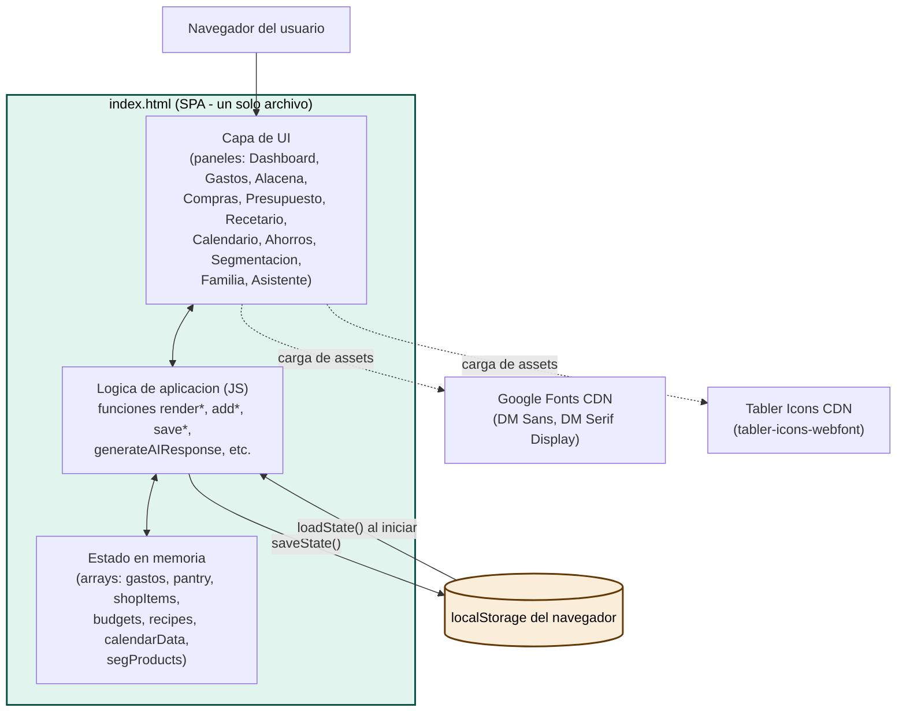
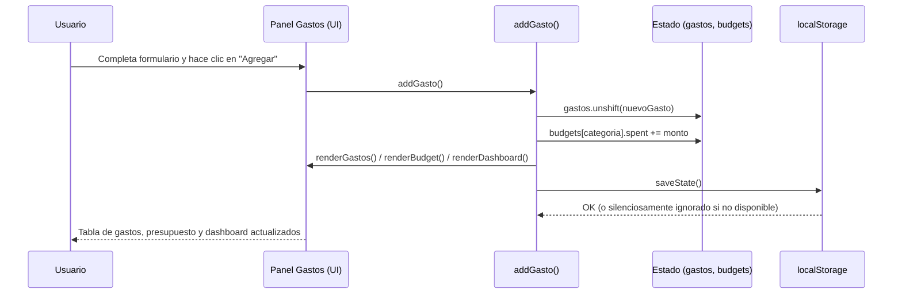

# Arquitectura del Sistema

## Visión General del Sistema

FamilyFinance es actualmente una **SPA (Single Page Application) 100% del lado del cliente**, implementada en un único archivo `index.html` (HTML + CSS + JavaScript embebidos). No existe backend, API propia, base de datos ni autenticación. El "estado" de la aplicación vive en variables JavaScript en memoria y se persiste en el `localStorage` del navegador del dispositivo donde se ejecuta. Los recursos externos son únicamente dos CDNs de assets estáticos (tipografías e íconos); no hay llamadas a APIs de terceros en producción (una integración previa con la API de Anthropic fue removida por ser insegura — ver `code-quality-assessment.md`).

## Diagrama de Arquitectura



### Alternativa en texto
```
Navegador -> UI (paneles) -> Logica JS -> Estado en memoria (arrays)
Logica JS <-> localStorage (guardar/restaurar estado entre recargas)
UI -> CDN Google Fonts (tipografia)
UI -> CDN Tabler Icons (iconografia)
```

## Descripción de Componentes

### Capa de UI (paneles HTML/CSS)
- **Propósito**: Presentar cada sección funcional (Dashboard, Gastos, Alacena, Compras, Presupuesto, Recetario, Calendario, Ahorros, Segmentación, Familia, Asistente) como un panel que se muestra/oculta con la clase `.panel.on`.
- **Responsabilidades**: Estructura visual, formularios de entrada, modales, navegación lateral y móvil.
- **Dependencias**: CSS con variables (`:root`) para el sistema de diseño (colores, tipografías, radios, sombras).
- **Tipo**: Presentación (Application, capa de vista).

### Lógica de Aplicación (funciones JavaScript)
- **Propósito**: Orquestar la navegación (`goTo`), renderizar cada panel a partir del estado (`renderGastos`, `renderPantry`, `renderShopList`, `renderBudget`, `renderRecipes`, `renderCalendar`, `renderSeg`, `renderDashboard`), y procesar acciones del usuario (`addGasto`, `saveAddPantry`, `toggleShopItem`, `saveNewRecipe`, `confirmAddToCalendar`, `changeSegProduct`, `sendAI`, etc.).
- **Responsabilidades**: Mantener sincronizados el estado en memoria, el DOM y `localStorage`; calcular métricas derivadas (totales, porcentajes, alertas).
- **Dependencias**: Estado en memoria (arrays de datos) y la Web API `localStorage`.
- **Tipo**: Application (lógica de negocio del cliente).

### Estado en Memoria (arrays JS)
- **Propósito**: Fuente de verdad en tiempo de ejecución: `gastos`, `pantry`, `shopItems`, `budgets`, `recipes`, `calendarData`, `segProducts`.
- **Responsabilidades**: Contener los datos de negocio que la UI renderiza y que las funciones de mutación modifican.
- **Dependencias**: Se inicializa con datos semilla (mock) y se sobrescribe con lo restaurado desde `localStorage` si existe.
- **Tipo**: Model (modelo de datos, en memoria — no hay persistencia server-side).

### Asistente Local (`generateAIResponse`)
- **Propósito**: Responder preguntas del usuario (recetas, ahorro, presupuesto, alacena) generando texto a partir de los datos reales de la app, sin llamar a ningún servicio externo.
- **Responsabilidades**: Interpretar palabras clave del texto del usuario y componer una respuesta con datos reales (totales de `budgets`, productos de `segProducts` marcados como prescindibles, recetas cuyos ingredientes coinciden con la `pantry`, etc.).
- **Dependencias**: Estado en memoria (`budgets`, `pantry`, `segProducts`, `recipes`).
- **Tipo**: Application (motor de reglas simple, no es un LLM real).

## Flujo de Datos



### Alternativa en texto
```
1. Usuario llena el formulario de gasto y confirma
2. addGasto() agrega el gasto al arreglo `gastos`
3. addGasto() incrementa el gasto de la categoria correspondiente en `budgets`
4. Se vuelven a renderizar: tabla de gastos, presupuesto y dashboard
5. saveState() persiste todo en localStorage
```

## Puntos de Integración

- **APIs Externas**: Ninguna en producción. (Existía una llamada directa e insegura a `api.anthropic.com` desde el navegador, sin headers de autenticación válidos; fue removida y reemplazada por el asistente local — ver `code-quality-assessment.md`).
- **Bases de Datos**: Ninguna. El único almacenamiento persistente es `localStorage` del navegador (por dispositivo/navegador, no compartido entre miembros de la familia).
- **Servicios de Terceros**:
  - Google Fonts (`fonts.googleapis.com`, `fonts.gstatic.com`) — tipografías DM Sans y DM Serif Display.
  - Tabler Icons (`cdn.jsdelivr.net/npm/@tabler/icons-webfont`) — set de íconos vía webfont.

## Componentes de Infraestructura

- **Infraestructura como código**: No aplica (no hay CDK/Terraform/CloudFormation; es un archivo estático).
- **Modelo de Despliegue**: Archivo HTML estático; puede servirse desde cualquier hosting estático (S3+CloudFront, GitHub Pages, Netlify, un simple servidor HTTP, etc.). Actualmente no hay pipeline de despliegue configurado en el repositorio.
- **Redes**: No aplica (sin backend propio que requiera VPC/subnets/security groups).
