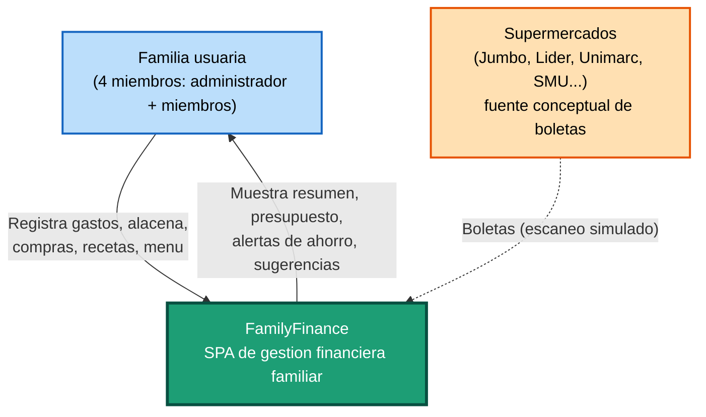

# Visión General del Negocio (Business Overview)

## Diagrama de Contexto de Negocio



### Alternativa en texto
```
Familia usuaria --(usa)--> FamilyFinance (SPA)
FamilyFinance --(reportes, alertas, sugerencias)--> Familia usuaria
Supermercados --(boletas, escaneo simulado)--> FamilyFinance
```

## Descripción del Negocio

- **Descripción General del Negocio**: FamilyFinance es una aplicación web de una sola página (SPA) pensada para que una familia chilena administre sus finanzas domésticas de forma centralizada: gasto mensual, presupuesto por categoría, inventario de alacena, lista de compras, recetario y menú mensual, y un asistente que sugiere ahorros y recetas según los datos reales de la familia. Actualmente es un **prototipo funcional del lado del cliente**, sin backend ni autenticación: todos los datos se guardan en el navegador (`localStorage`) del dispositivo donde se usa.

- **Transacciones de Negocio**: Estas son las transacciones/casos de uso que el sistema implementa hoy:
  1. **Registrar un gasto** — un miembro de la familia agrega un gasto (descripción, monto, categoría); el sistema actualiza el historial, el presupuesto de esa categoría y el resumen del dashboard.
  2. **Escanear una boleta (simulado)** — el usuario "escanea" una boleta y el sistema muestra una lista de productos detectados y su total (datos de demostración, no OCR real).
  3. **Gestionar la alacena** — agregar/ver productos en stock, con alerta cuando un producto está por agotarse.
  4. **Gestionar la lista de compras** — agregar productos, marcarlos como comprados, o generarla automáticamente a partir del menú planificado en el calendario.
  5. **Seguir el presupuesto** — ver cuánto se ha gastado y cuánto queda disponible por categoría (supermercado, servicios, transporte, salud, entretenimiento).
  6. **Planificar el menú del mes** — asignar recetas a días del calendario (almuerzo/cena/desayuno) y generar la lista de compras correspondiente.
  7. **Consultar el recetario** — filtrar recetas por tipo de comida o por rapidez, ver ingredientes y pasos, agregar recetas propias.
  8. **Clasificar productos (segmentación)** — clasificar cada producto habitual en "1ª categoría" (esencial), "2ª categoría" (complementario) o "prescindible", para identificar oportunidades de ahorro.
  9. **Consultar al asistente** — hacer preguntas en lenguaje natural (recetas, ahorro, presupuesto, alacena) y recibir una respuesta generada localmente a partir de los datos reales de la familia (sin llamadas a servicios externos).
  10. **Gestionar miembros de la familia** — ver quién gastó cuánto y cuántas transacciones hizo cada persona.

- **Diccionario de Negocio**:
  | Término | Significado |
  |---|---|
  | **Gasto** | Un movimiento de dinero registrado por un miembro de la familia, asociado a una categoría. |
  | **Alacena** | Inventario de productos que la familia tiene en casa, con indicador de "por agotarse". |
  | **Presupuesto** | Monto máximo asignado por categoría de gasto para el mes. |
  | **Segmentación** | Clasificación de un producto según qué tan esencial es: 1ª categoría (esencial), 2ª categoría (complementario) o Prescindible (candidato a eliminar para ahorrar). |
  | **Boleta** | Comprobante de una compra en el supermercado; en este prototipo, su "escaneo" es una simulación con datos fijos. |
  | **Familia García** | La familia de ejemplo usada como dato semilla del prototipo (4 miembros). |

## Descripciones de Negocio por Componente

### SPA FamilyFinance (`index.html`)
- **Propósito**: Punto único de gestión financiera y doméstica de la familia; concentra todas las funciones de negocio listadas arriba en una sola pantalla con navegación por paneles.
- **Responsabilidades**: Presentar el estado financiero actual, permitir el registro de nuevos gastos/productos/recetas, calcular métricas derivadas (totales, porcentajes de presupuesto, productos por agotarse) y persistir los cambios del usuario en el navegador.
