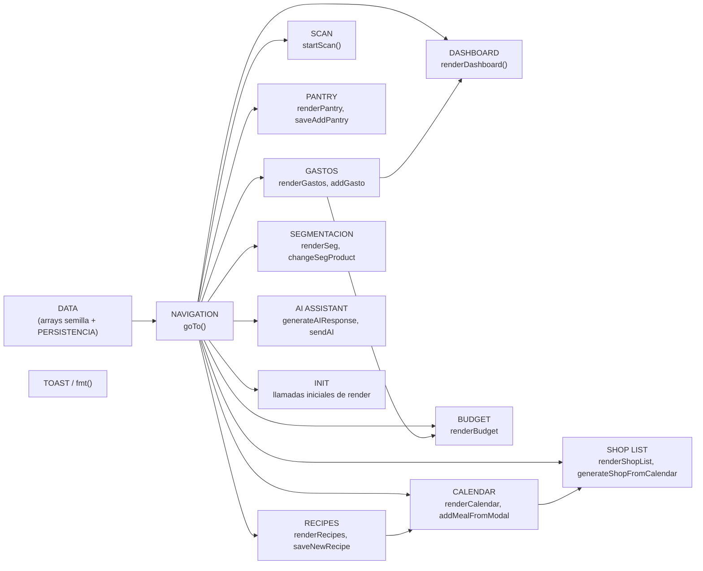

# Estructura del Código

## Sistema de Build
- **Tipo**: Ninguno. No hay `package.json`, bundler, transpilador ni gestor de dependencias. El archivo `index.html` se sirve tal cual (HTML + `<style>` + `<script>` inline).
- **Configuración**: No aplica. Los únicos recursos externos son enlaces `<link>` a Google Fonts y al CSS de Tabler Icons, y no hay pipeline de compilación.

## Módulos / Clases Clave

No hay clases ni módulos ES en el sentido estricto (todo vive en un único `<script>` global). El código se organiza por **secciones funcionales** delimitadas con comentarios `// ═══...═══`:



### Alternativa en texto
```
DATA (arrays semilla + persistencia)
  -> NAVIGATION (goTo)
       -> DASHBOARD / GASTOS / SCAN / PANTRY / SHOP LIST / BUDGET
          / RECIPES / CALENDAR / SEGMENTACION / AI ASSISTANT
  -> INIT (llama a todos los render* al cargar la pagina)
GASTOS afecta a BUDGET y DASHBOARD (al agregar un gasto)
CALENDAR alimenta a SHOP LIST (generar lista desde el menu)
```

### Inventario de Archivos Existentes
- `index.html` — Único archivo de la aplicación. Contiene:
  - `<style>` (líneas ~11–253): sistema de diseño con variables CSS (`:root`), layout (sidebar + topbar + contenido), componentes (cards, tablas, tags, formularios, modales, calendario, chat de IA) y estilos responsive.
  - Marcado HTML (líneas ~255–673): sidebar de navegación, topbar, y un panel `<div class="panel" id="panel-*">` por cada sección de negocio.
  - `<script>` (líneas ~675 en adelante): datos semilla, persistencia (`localStorage`), navegación, y una función `render*`/`add*`/`save*` por sección, más el asistente local.

## Patrones de Diseño

### Patrón "Panel + Render function" (SPA sin framework)
- **Ubicación**: Cada sección de negocio (`panel-dashboard`, `panel-gastos`, `panel-alacena`, etc.) más su función `render*()` correspondiente.
- **Propósito**: Simular una SPA con ruteo por pestañas sin usar un framework (React/Vue/Angular): `goTo(id)` oculta/muestra el panel correspondiente y llama a la función de render asociada para refrescar sus datos.
- **Implementación**: `document.querySelectorAll('.panel').forEach(p => p.classList.remove('on'))` seguido de `panel.classList.add('on')`; cada `render*()` regenera el `innerHTML` de un contenedor a partir del estado en memoria.

### Patrón "Estado + Persistencia explícita"
- **Ubicación**: `saveState()` / `loadState()` / IIFE `restoreState()`.
- **Propósito**: Sobrevivir a recargas de página guardando el estado completo (gastos, alacena, compras, recetas, calendario, segmentación, presupuesto) en `localStorage` bajo una única clave (`familyfinance_state_v1`).
- **Implementación**: Cada función que muta el estado (`addGasto`, `saveAddPantry`, `toggleShopItem`, etc.) llama explícitamente a `saveState()` al final; al cargar la página, una IIFE intenta restaurar el estado antes de la primera renderización.

### Patrón "Diseño por tokens CSS"
- **Ubicación**: Bloque `:root { --teal:...; --amber:...; ... }`.
- **Propósito**: Centralizar la paleta de colores, tipografías, radios y sombras para mantener consistencia visual entre secciones.
- **Implementación**: Variables CSS consumidas en todo el `<style>` (p. ej. `background:var(--teal-l)`).

## Dependencias Críticas

### Google Fonts (DM Sans, DM Serif Display)
- **Versión**: N/A (servido dinámicamente por Google Fonts, sin versión fija).
- **Uso**: Tipografía principal (`--font`) y tipografía de acento serif (`--font-serif`, declarada pero sin uso visible actual en el marcado).
- **Propósito**: Identidad visual de la marca.

### Tabler Icons Webfont (`@tabler/icons-webfont@3.0.0`)
- **Versión**: 3.0.0 (fijada vía CDN de jsDelivr).
- **Uso**: Íconos en toda la interfaz (`<i class="ti ti-*">`).
- **Propósito**: Iconografía consistente sin necesidad de SVGs individuales.

### Web Storage API (`localStorage`)
- **Versión**: Estándar del navegador (no es una librería).
- **Uso**: Persistencia de todo el estado de la aplicación entre sesiones/recargas.
- **Propósito**: Simular persistencia sin backend. Limitación: los datos son locales al navegador/dispositivo, no se sincronizan entre los miembros de la familia ni entre dispositivos.
