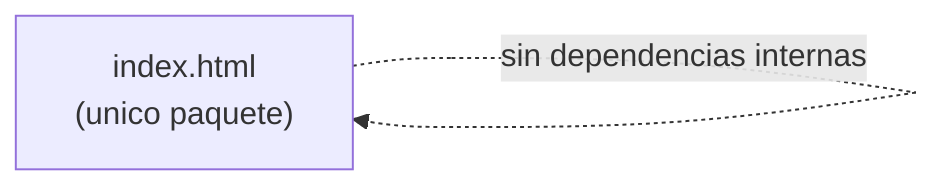

# Dependencias

## Dependencias Internas

No aplica: el proyecto es un único archivo (`index.html`) sin paquetes internos ni módulos separados que dependan entre sí.



### Alternativa en texto
```
index.html no depende de ningun otro paquete interno (es monolitico de un solo archivo).
```

## Dependencias Externas

### Google Fonts — `DM Sans` / `DM Serif Display`
- **Versión**: N/A (servidas dinámicamente, sin versión fijada por el proyecto).
- **Propósito**: Tipografía de marca (sans-serif principal y serif de acento).
- **Licencia**: Open Font License (OFL) — fuentes de Google Fonts.

### Tabler Icons Webfont
- **Versión**: `3.0.0` (fijada explícitamente en la URL del CDN de jsDelivr).
- **Propósito**: Set de íconos (`<i class="ti ti-*">`) usado en toda la interfaz.
- **Licencia**: MIT (Tabler Icons).

## Notas de Riesgo de Dependencias
- Ambas dependencias se cargan desde CDNs externos sin *Subresource Integrity* (`integrity="sha384-..."`) ni fallback local: si el CDN falla o es comprometido, la app pierde estilo/iconos (o, en el peor caso, podría verse afectada por contenido malicioso servido desde ese CDN). Esto es un hallazgo a considerar en `code-quality-assessment.md`.
